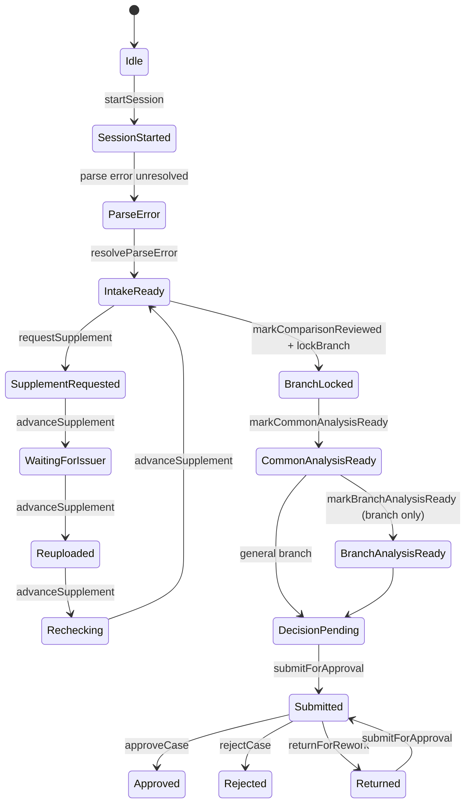

/* Phase: P0 — demo-script */

# DEMO_SCRIPT

## Demo Path
1. `/stage1` 대시보드에서 `심사 시작` 클릭
2. `/stage2`에서 `세션 시작` 클릭
3. 파싱 오류 행에서 `재파싱 완료 표시` 클릭
4. `다음 루프 상태`를 눌러 `required → requested → waiting → reuploaded → rechecking → resolved` 흐름을 빠르게 보여주기
5. `비교 결과 검토 완료 표시` 클릭
6. 브랜치를 `후순위채`로 선택하고 `구조 확정` 클릭
7. `다음 단계: Stage 3` 클릭
8. `/stage3`에서 `공통 분석 완료 표시` 클릭
9. `다음 단계: 브랜치 분석` 클릭
10. `/stage3/subordinated`에서 `브랜치 출력 준비 완료 표시` 클릭
11. `다음 단계: Stage 4` 클릭
12. `/stage4`에서 `수정 후 확정` 클릭 후 판단 근거 1줄 입력
13. `다음 단계: 보고서 작성` 클릭
14. `/stage5`에서 `Insert AI Draft`를 한두 섹션에 눌러 편집 가능성과 evidence badge를 보여주기
15. source badge 하나를 눌러 `Phase 2: source highlight viewer` toast 확인
16. `승인 단계로 제출` 클릭
17. `/stage6`에서 승인 코멘트 1줄 입력 후 `승인` 클릭
18. `/stage7`에서 covenant tracker, Delay / EOD rail, AI reminder suggestions를 보여주며 `Phase 1 read-only` 배너 설명

## Do-Not-Click List
- 좌측 사이드바의 `포트폴리오`, `규제 준수`, `보고서`
- 헤더의 `검색`, `알림`, `계정`
- 푸터의 `보안 가이드`, `감사 로그`, `지원`
- Stage 7의 `Phase 2 액션 보기`, `모니터링 패키지 내보내기`
- AI Copilot의 extra action 버튼들
- Stage 5 source badge는 눌러도 되지만 실제 뷰어는 없고 Phase 2 toast만 뜸

## Expected Q&A
### Where's the backend?
이 프로토타입은 stakeholder demo용 프런트엔드이며, 이번 버전은 backend 없이 mock layer만 사용합니다. 대신 화면과 코드에서 `triggerApi`를 명시해 FastAPI 연동 지점을 그대로 보여주도록 설계했습니다.

### Is the AI actually called?
아니요. 현재 AI Copilot은 stage/branch별 mock scenario를 사용하고, 300–800ms 지연과 typing 상태로 UX만 시뮬레이션합니다. 실제 API 호출은 없고, `// TODO(phase-2): replace with /v1/analysis/jobs`로 교체 지점을 코드에 남겨두었습니다.

### Why is Stage 7 read-only?
내일 데모의 목표는 승인 이후 운영 모니터링 콘솔이 어떤 모습인지 정직하게 보여주는 것입니다. 실제 알림 발송, 감시 등급 변경, 자동 조치는 Phase 2 백엔드와 감사 로그 API가 준비된 뒤 활성화할 예정입니다.

### How does this state machine port to FastAPI?
현재 `WorkflowContext`가 상태 전이 규칙을 프런트엔드에서 증명하고 있고, FastAPI 단계에서는 이 전이를 `review-sessions`, `transitions`, `decisions`, `supplement-requests` 같은 엔드포인트와 서버 상태 테이블로 옮기면 됩니다. 화면은 그대로 두고, local mutation만 API mutation으로 치환하는 방식이 가장 자연스럽습니다.

### Is OAuth state really verified?
현재 프런트엔드에서는 nonce 생성과 세션 저장, 검증 helper/scaffolding까지 준비합니다. OAuth state verification completes when the Phase 2 backend callback is implemented.

## Slide Content Summaries
### PRD-to-Route Traceability

| PRD Stage | Route | Screen | Demo Message |
| --- | --- | --- | --- |
| 1 | `/stage1` | Dashboard | 접수 및 케이스 진입점 |
| 2 | `/stage2` | Intake / Upload / Initial Check | 세션 시작, 파싱 오류, 보완 루프, 구조 확정 |
| 3 | `/stage3` | Common Analysis | 공통 분석과 브랜치 분기 |
| 3 | `/stage3/subordinated` | Subordinated Branch Analysis | 후순위 구조 분석 |
| 3 | `/stage3/perpetual` | Perpetual Branch Analysis | 영구채 구조 분석 |
| 4 | `/stage4` | Integrated Review / Human Confirm | AI 결과를 사람이 확정 |
| 5 | `/stage5` | Report Editor | 편집 가능 보고서와 evidence 연결 |
| 6 | `/stage6` | Approval | 승인, 반려, 재작업 |
| 7 | `/stage7` | Monitoring Console | 승인 후 읽기 전용 사후관리 |

### WorkflowContext State Machine

### Phase 2 Roadmap
- Real LLM integration with `/v1/analysis/jobs` async orchestration
- Stage 7 automation: reminder send, alert queue, watchlist transitions
- Source highlight viewer for Stage 5 evidence badges
- Audit log API and approval trace history
- OAuth callback verification completion on backend
- Per-case persisted workflow sessions and multi-case switching

## Phase 2 Roadmap Detail
- Backend review-session model and transition audit trail
- Real document parsing and classification jobs
- Evidence chunk retrieval and source highlight overlay
- Monitoring action center with reminder approval workflow
- Role-based access, OAuth callback verification, secure production auth
